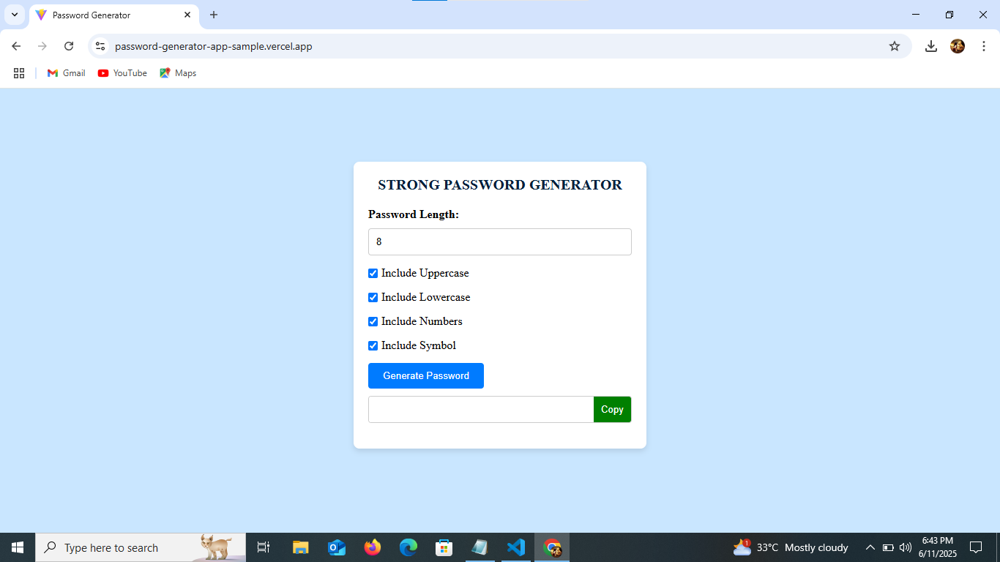
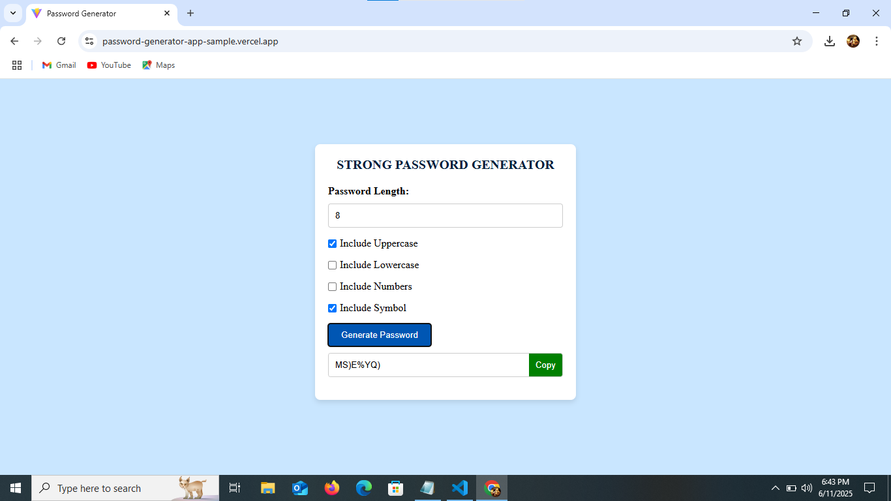
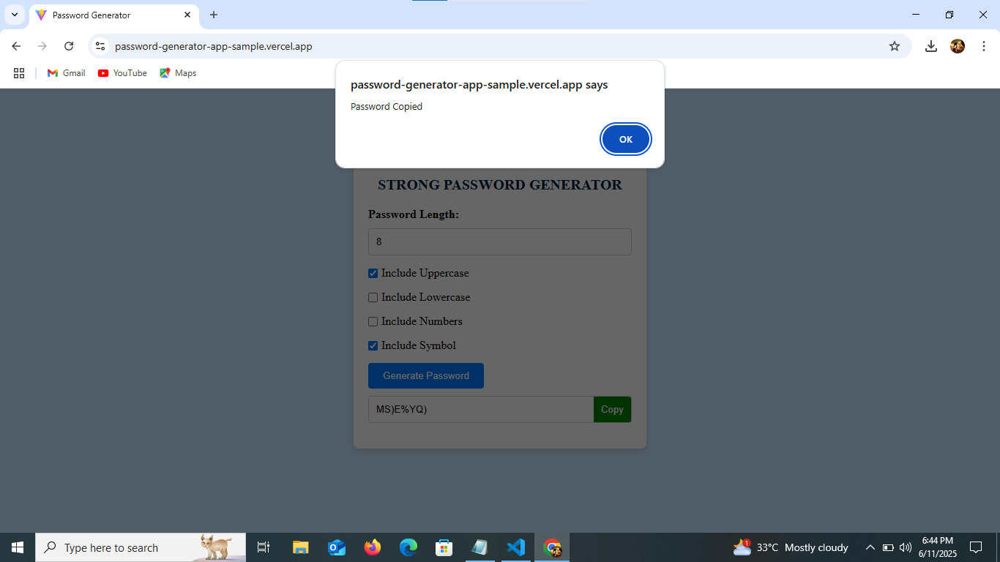

# React Strong Password Generator

A simple and secure password generator built using React. Customize the password by selecting character types and desired length.

## Live Demo

🔗 [Live Demo](https://password-generator-app-sample.vercel.app/)  

## Developed By  
**Gayathri G**  
GitHub: [GAYATHRI1006](https://github.com/GAYATHRI1006)

## Screenshot







## Features

- Generate secure passwords  
- Choose length of password  
- Option to include:  
  - Uppercase letters  
  - Lowercase letters  
  - Numbers  
  - Symbols  
- Copy generated password to clipboard

## Getting Started

### 1. Clone the Repository

```bash
git clone https://github.com/GAYATHRI1006/Password_Generator_App.git
```

### 2. Install Dependencies

```bash
npm install
```

### 3. Run the App

```bash
npm run dev
```

## Tech Stack

- **React**
- **JavaScript**
- **HTML5**
- **CSS3**                    
